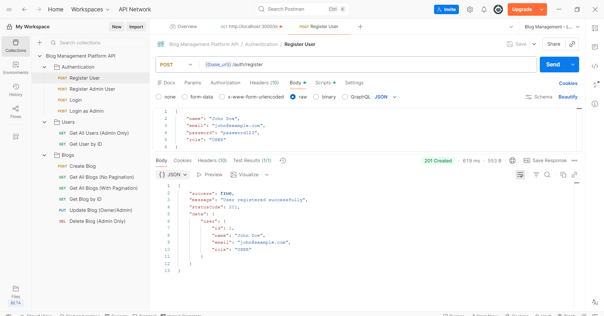
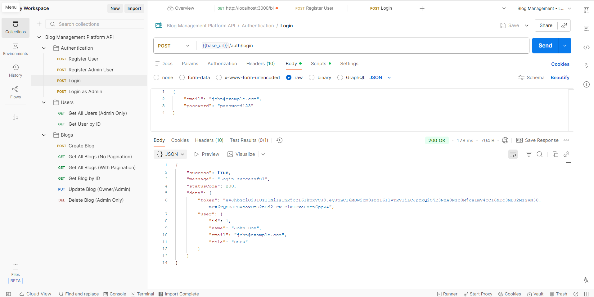
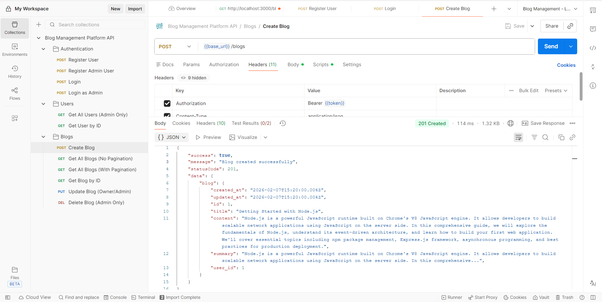
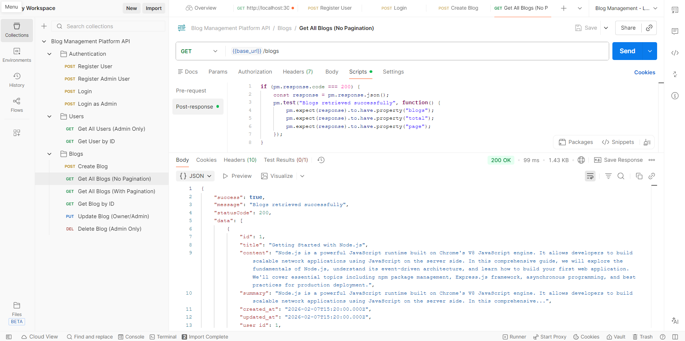
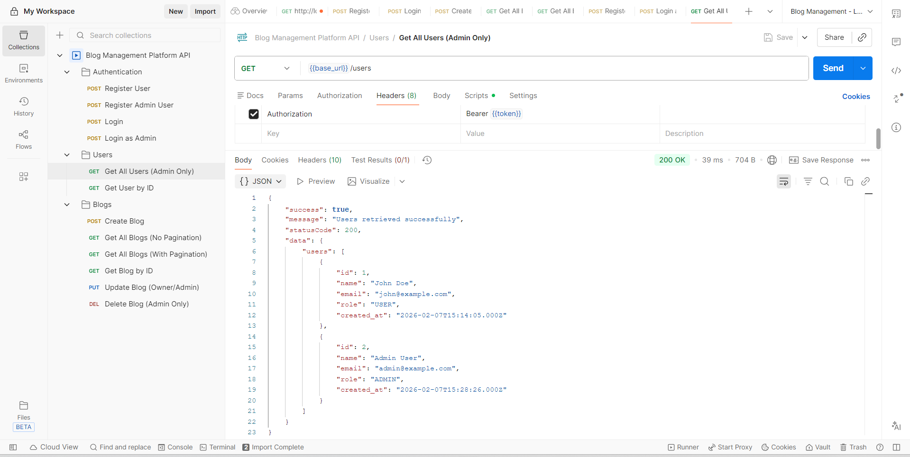
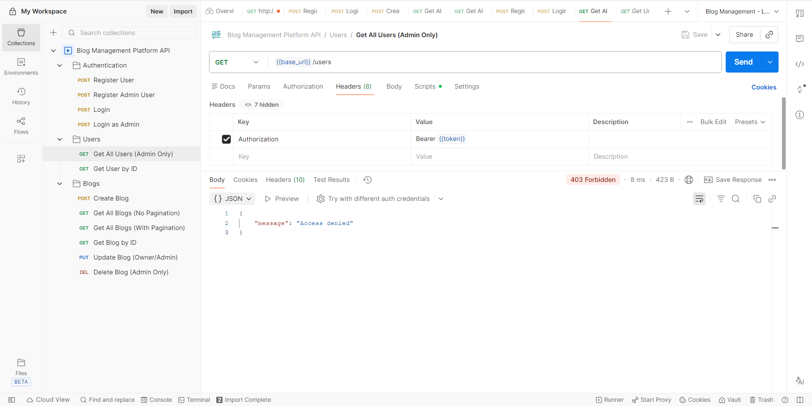

# Postman Collection Guide

##  Files Included

1. **`Blog_Management_API.postman_collection.json`** - Complete API collection with all endpoints
2. **`Blog_Management_Local.postman_environment.json`** - Environment variables for local development

##  Quick Start

### Step 1: Import Collection

1. Open Postman
2. Click **Import** button (top left)
3. Drag and drop or select both files:
   - `Blog_Management_API.postman_collection.json`
   - `Blog_Management_Local.postman_environment.json`
4. Click **Import**

### Step 2: Select Environment

1. Click the environment dropdown (top right)
2. Select **"Blog Management - Local"**

### Step 3: Start Your Server

Make sure your backend is running:

```bash
# Local development
npm run dev

# OR with Docker
docker-compose up
```

Server should be running on `http://localhost:3000`

##  Collection Structure

The collection is organized into 3 folders:

### 1️. Authentication (4 requests)
- **Register User** - Create a regular user account
- **Register Admin User** - Create an admin account
- **Login** - Authenticate as regular user
- **Login as Admin** - Authenticate as admin

### 2️. Users (2 requests)
- **Get All Users** - List all users (Admin only)
- **Get User by ID** - Get specific user details (Protected)

### 3️. Blogs (6 requests)
- **Create Blog** - Create new blog post (Authenticated)
- **Get All Blogs (No Pagination)** - Get blogs with default pagination
- **Get All Blogs (With Pagination)** - Custom pagination example
- **Get Blog by ID** - Get specific blog details
- **Update Blog** - Update existing blog (Owner/Admin)
- **Delete Blog** - Delete blog (Admin only)

##  Automated Workflows

The collection includes automated test scripts that:

### Auto-Save Variables
- **After Registration:** Saves `user_id`
- **After Login:** Saves `token` and `user_id`
- **After Create Blog:** Saves `blog_id`

### Auto-Validation
- Verifies response status codes
- Checks response structure
- Validates data types
- Tests business logic

##  Usage Flow

### Scenario 1: Regular User Workflow

```
1. Register User
   └─> Saves user_id

2. Login
   └─> Saves token & user_id

3. Create Blog
   └─> Saves blog_id
   └─> Summary auto-generated

4. Get All Blogs
   └─> View all blogs with pagination

5. Update Blog (own blog)
   └─> Summary regenerated

6. Try Delete Blog
   └─> Should fail (not admin)
```

### Scenario 2: Admin Workflow

```
1. Register Admin User
   └─> Create admin account

2. Login as Admin
   └─> Saves admin token

3. Get All Users
   └─> Admin-only endpoint

4. Delete Blog
   └─> Admin can delete any blog
```

### Scenario 3: Testing Pagination

```
1. Create multiple blogs (3-5)

2. Get All Blogs (No Pagination)
   └─> Default: page=1, limit=10

3. Get All Blogs (With Pagination)
   └─> Custom: page=2, limit=5
   └─> Verify pagination response
```

##  Environment Variables

The environment includes these variables:

| Variable | Description | Auto-set |
|----------|-------------|----------|
| `base_url` | API base URL (http://localhost:3000) | No |
| `token` | JWT authentication token | Yes ✓ |
| `admin_token` | Admin user JWT token | Yes ✓ |
| `user_id` | Current user ID | Yes ✓ |
| `blog_id` | Last created blog ID | Yes ✓ |

**Note:** Variables marked "Auto-set" are automatically populated by test scripts.

##  Test Scripts

Each request includes automated tests:

### Example: Login Request Tests
```javascript
- Saves token to environment
- Saves user_id to environment
- Validates response has token
- Validates response has user object
```

### Example: Create Blog Tests
```javascript
- Saves blog_id to environment
- Validates blog created
- Validates summary was auto-generated
- Checks summary is not empty
```

### View Test Results
After running a request:
1. Click on **Test Results** tab (bottom)
2. See which tests passed/failed
3. View console logs for saved variables

##  Manual Testing Steps

### Test 1: User Registration & Authentication
```
1. Run "Register User"
   ✓ Status: 201
   ✓ message: "User registered successfully"
   ✓ user_id saved

2. Run "Login"
   ✓ Status: 200
   ✓ Returns token
   ✓ Token auto-saved
```

### Test 2: Blog Creation & Summary
```
1. Run "Create Blog"
   ✓ Status: 201
   ✓ summary field exists
   ✓ summary = first 200 chars + "..."
   ✓ blog_id saved
```

### Test 3: Pagination
```
1. Create 5+ blogs

2. Run "Get All Blogs (With Pagination)"
   ✓ Returns correct page number
   ✓ Respects limit parameter
   ✓ Includes total count
   ✓ Calculates totalPages
```

### Test 4: Role-Based Access Control
```
1. Login as regular user

2. Run "Get All Users"
   ✗ Status: 403 (Forbidden)
   
3. Login as Admin

4. Run "Get All Users"
   ✓ Status: 200 (Success)
```

### Test 5: Ownership & Admin Rights
```
1. User A creates a blog

2. User B tries to update User A's blog
   ✗ Status: 403 (Access denied)

3. Admin tries to update User A's blog
   ✓ Status: 200 (Success)
```

##  Troubleshooting

### Issue: "No token provided"
**Solution:** Make sure you've logged in first. The token is auto-saved after successful login.

### Issue: "Invalid token"
**Solution:** Token might have expired (24 hours). Login again.

### Issue: Variables not saving
**Solution:** 
1. Check environment is selected (top right)
2. Run login request again
3. Check Console for "Token saved" message

### Issue: 403 Access Denied
**Solution:** Check if endpoint requires admin role. Login as admin user.

### Issue: Connection refused
**Solution:** 
1. Verify server is running: `npm run dev`
2. Check port 3000 is not in use
3. Verify base_url in environment

### Issue: Blog not found (404)
**Solution:** Make sure `blog_id` variable is set. Run "Create Blog" first.

##  Testing with Docker

If using Docker Compose:

```bash
# Start services
docker-compose up -d

# Verify API is accessible
curl http://localhost:3000

# Use Postman collection normally
# base_url is already set to localhost:3000
```

**Note:** Make sure to use port **3000** (not 3307 which is MySQL).

##  Testing Checklist

Use this checklist to verify all functionality:

### Authentication
- [ ] Register regular user
- [ ] Register admin user
- [ ] Login with correct credentials
- [ ] Login fails with wrong password
- [ ] Token is saved automatically

### Users
- [ ] Admin can get all users
- [ ] Regular user cannot get all users (403)
- [ ] User can get own details
- [ ] Admin can get any user's details

### Blogs - Create & Read
- [ ] Authenticated user can create blog
- [ ] Summary is auto-generated (200 chars)
- [ ] Can get all blogs without auth
- [ ] Pagination works (page & limit)
- [ ] Can get single blog by ID
- [ ] Blog includes author info

### Blogs - Update & Delete
- [ ] Owner can update own blog
- [ ] Admin can update any blog
- [ ] Non-owner cannot update blog (403)
- [ ] Summary regenerates on content update
- [ ] Admin can delete any blog
- [ ] Non-admin cannot delete blog (403)

##  Sample Data

The collection includes realistic sample data:

### Sample User
```json
{
  "name": "John Doe",
  "email": "john@example.com",
  "password": "password123",
  "role": "USER"
}
```

### Sample Admin
```json
{
  "name": "Admin User",
  "email": "admin@example.com",
  "password": "admin123",
  "role": "ADMIN"
}
```

### Sample Blog
```json
{
  "title": "Getting Started with Node.js",
  "content": "Node.js is a powerful JavaScript runtime..."
}
```

##  Advanced Usage

### Using Collection Runner

1. Click collection name
2. Click **Run** button
3. Select requests to run
4. Set iterations (1 for single run)
5. Click **Run Blog Management API**
6. View aggregated results

### Exporting Test Results

1. Run Collection Runner
2. After completion, click **Export Results**
3. Choose format (JSON/CSV)
4. Save for documentation

### Environment Switching

Create additional environments for:
- **Production:** `https://api.yourdomain.com`
- **Staging:** `https://staging.api.yourdomain.com`
- **Docker:** `http://localhost:3000`

Just change the `base_url` variable!

##  Screenshots for Documentation

1. **Imported Collection** -


2. **Successful Login** -



3. **Create Blog** - 


4. **Pagination** - 



5. **Admin Access** -


6. **Access Denied** - 


7. **Test Results** - 


8. **Environment Variables** - 


##  Additional Resources

- [Postman Documentation](https://learning.postman.com/docs/)
- [Postman Test Scripts](https://learning.postman.com/docs/writing-scripts/test-scripts/)
- [Environment Variables](https://learning.postman.com/docs/sending-requests/variables/)

##  Support

If you encounter issues:

1. Check server is running
2. Verify environment is selected
3. Check Console tab for errors
4. Retry login to refresh token
5. Check API endpoint in README.md

##  Features Demonstrated

This collection showcases:

 **JWT Authentication** - Token-based auth  
 **Role-Based Access Control** - Admin vs User permissions  
 **CRUD Operations** - Complete blog management  
 **Pagination** - Query parameters for large datasets  
 **Auto-Summarization** - Content processing logic  
 **Relationship Management** - User-Blog associations  
 **Automated Testing** - Test scripts for validation  
 **Environment Variables** - Dynamic value management  
 **Error Handling** - Proper HTTP status codes  
 **Security** - Password hashing, protected routes  

---

**Created by:** Dinusha Herath  
**Date:** February 7, 2026  
**Assignment:** Decryptogen Technical Assessment
